#  UTS Project App  

Aplikasi ini merupakan proyek UTS yang menampilkan berbagai fitur interaktif — mulai dari **kalkulator sederhana**, **daftar kontak**, **berita terkini**, **form biodata pengguna**, hingga **tampilan cuaca dengan data dummy dan forecast**.  

---
- Nama  : Arsyad Effendi
- NRP   : 152023107
- Kelas : AA
- Matkul: Pemrograman Mobile
- Prodi : Informatika
---
## 1. Splash Screen  
Saat aplikasi dijalankan, muncul tampilan awal (**Splash Screen**) yang berisi:  

- **Judul proyek:** *UTS Project*
- **Foto**  
- **NRP**  
- **Nama lengkap**    
- **Kelas**
- **Animasi loading screen selama 5 detik**

## 2. Fitur Calculator  
Fitur ini memungkinkan pengguna melakukan berbagai operasi matematika dasar, yaitu:  

- **Penjumlahan (Tambah)**  
- **Pengurangan (Kurang)**  
- **Perkalian (Kali)**  
- **Pembagian (Bagi)**  
- **Kuadrat (X²)**  
- **Akar Kuadrat (√x)**  

Selain itu:  
- **Delete All** – Menghapus semua input sekaligus.  
- **Delete One** – Menghapus satu digit terakhir dari input.  

---

## 3. Fitur Contact  
Fitur ini menampilkan daftar kontak lengkap dengan foto profil dan ikon untuk aksi (belum aktif).  

**Fungsionalitas:**  
- **Menampilkan daftar kontak lengkap.**  
- **Kontak diurutkan berdasarkan** **huruf awal nama (A–Z).**  
- **Search bar** untuk mencari kontak dengan cepat.  
- **Circle Image** untuk setiap kontak (foto profil).  
- **Icon Call** dan **Icon Message** (hanya tampilan visual, belum berfungsi).  

---

## 4. Fitur Berita  
Fitur ini menampilkan daftar berita yang dapat dicari dan difilter berdasarkan kategori.  

**Fungsionalitas:**  
- **Menampilkan daftar berita (dengan judul, gambar, dan isi singkat).**  
- **Pencarian berita** berdasarkan kata kunci.  
- **Kategori berita** (misal: Teknologi, Olahraga, Politik).  

---

## 5. Fitur Biodata  
Fitur form biodata ini digunakan untuk mengisi data diri pengguna dengan komponen input yang lengkap.  

**Komponen Input:**  
- **NRP**  
- **Nama**  
- **Nomor Telepon**  
- **Email**  
- **Tanggal Lahir** (Date Picker)  
- **Dropdown Prodi**  
- **Radio Button Jenis Kelamin** (Laki-laki / Perempuan)  
- **Radio Button Hobi** (Beberapa pilihan hobi) 
- **Ketika "Simpan Data" akan menampilkan Data dari inputan yang dibuat**

---

## 6. Fitur Cuaca  
Fitur ini menampilkan informasi cuaca dengan data dummy (simulasi).  

**Fungsionalitas:**  
- **Data Cuaca Hari Ini** (temperatur, kondisi, dan ikon cuaca).  
- **Forecast 11 jam ke depan** (dengan suhu dan ikon).  
- **Ganti Lokasi Cuaca** dengan tombol **Next** di ujung tampilan.  
- **Detail cuaca harian** – Menampilkan informasi lengkap dari cuaca hari ini.  

--- 

## Preview Tampilan 

<h3 align="center">Splash Screen</h3>

  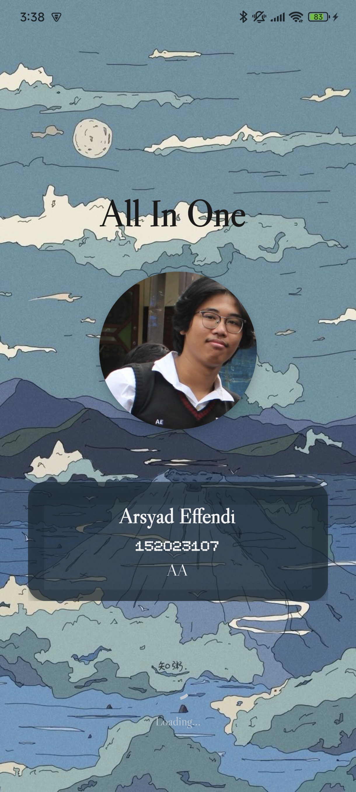

<h3 align="center">Biodata</h3>

  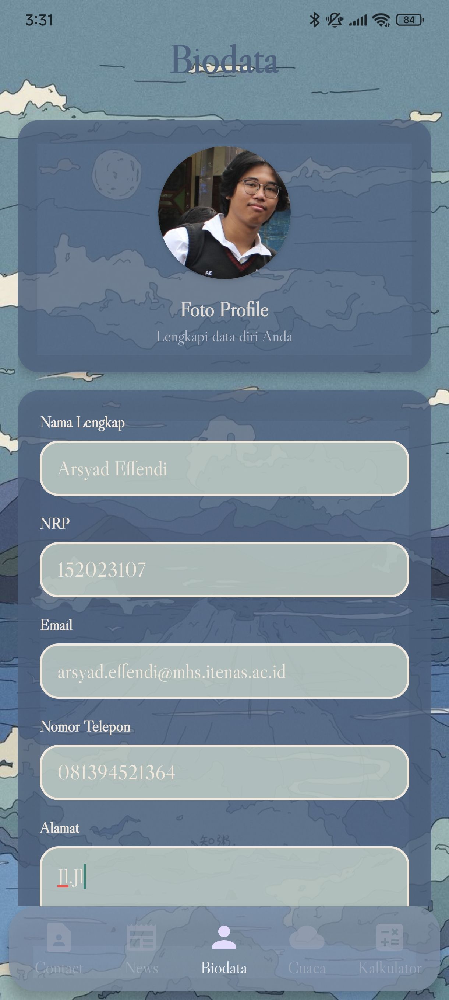
  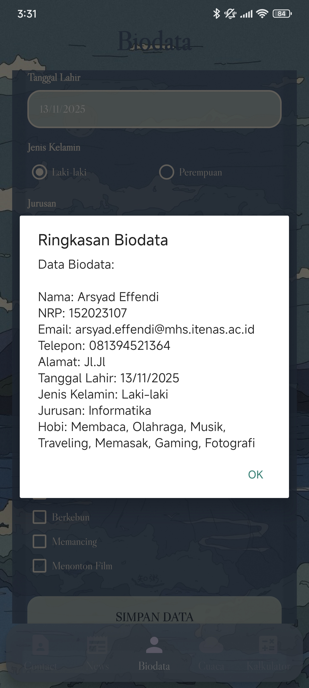

<h3 align="center">Calculator</h3>

  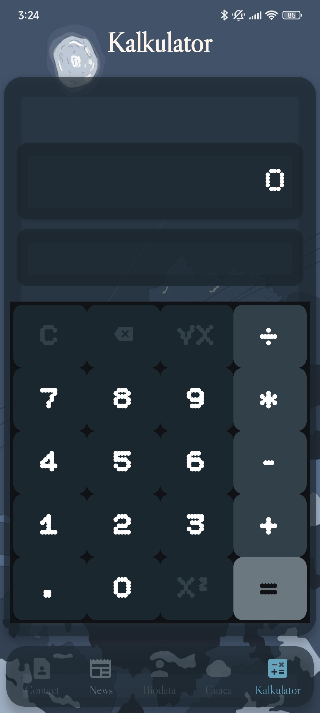
  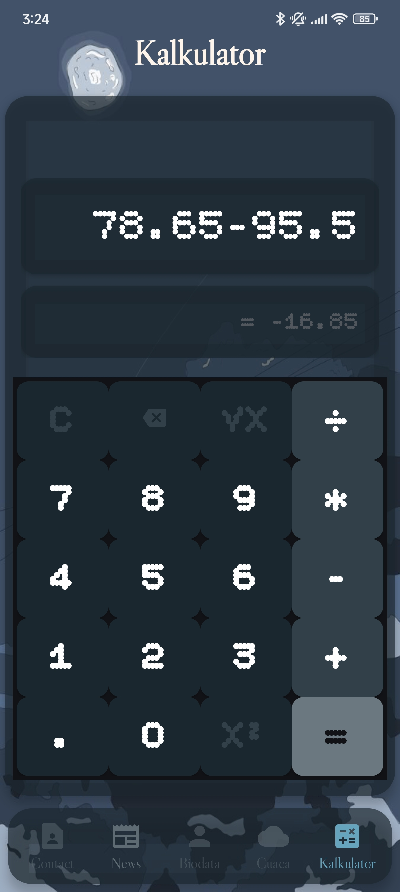

<h3 align="center">Berita</h3>

  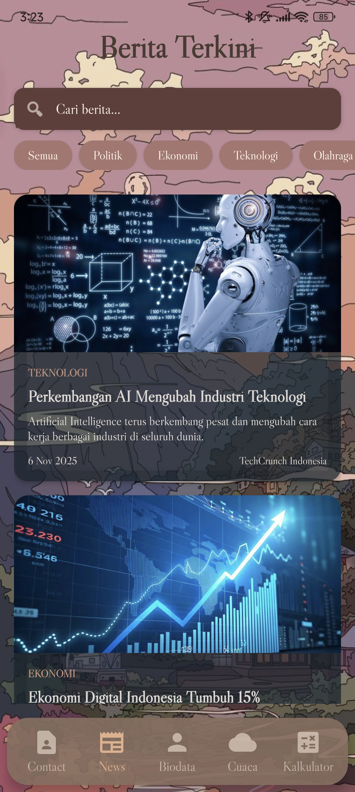
  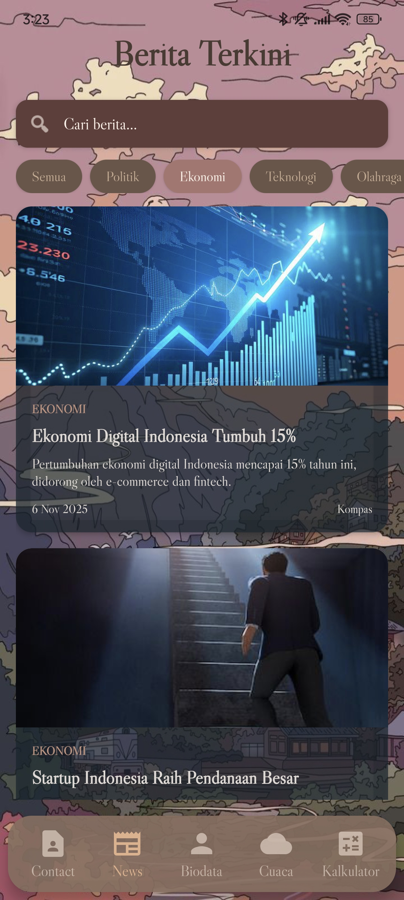

<h3 align="center">Cuaca</h3>

  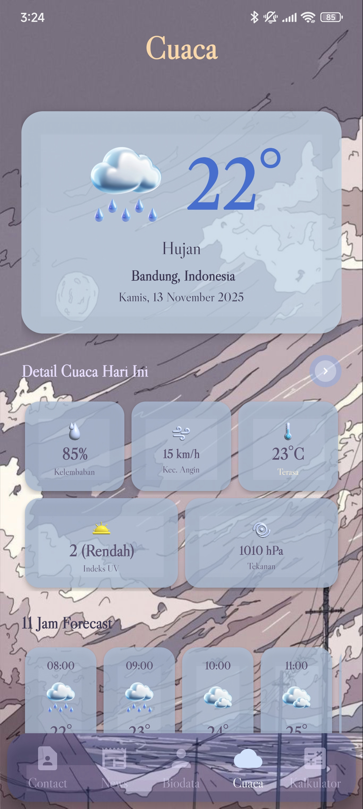
  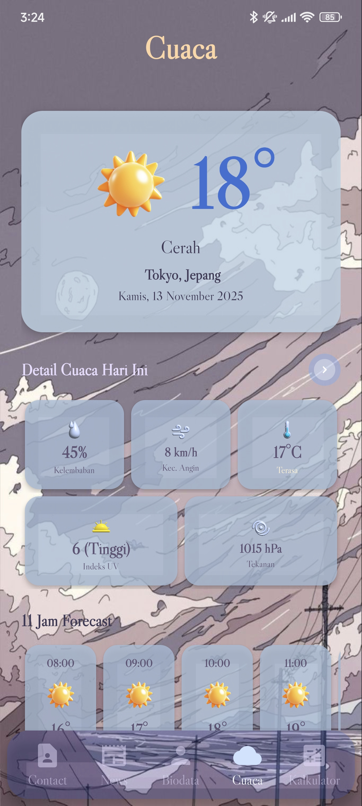

<h3 align="center">Contact</h3>

  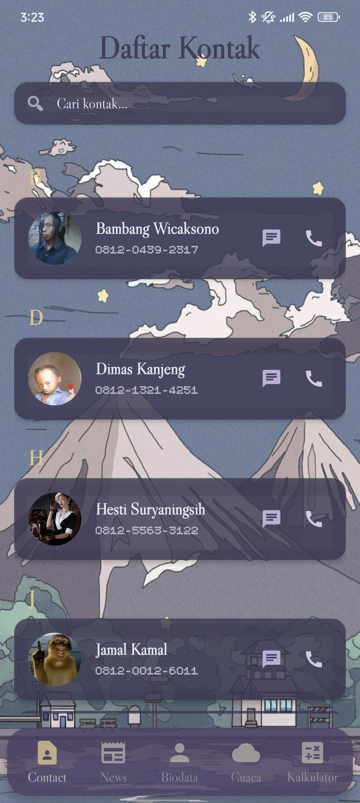
  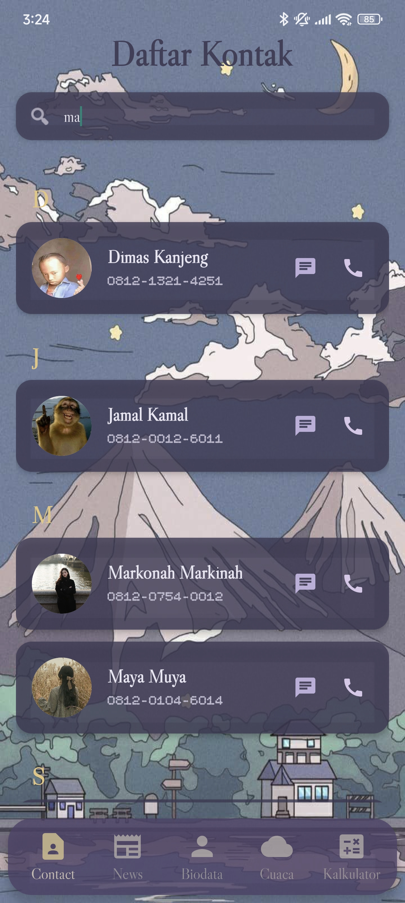

